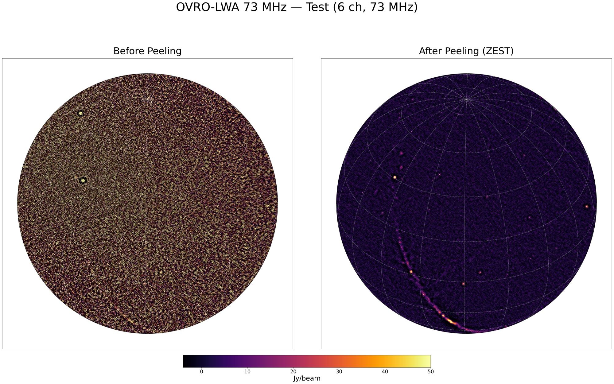

# TTCalX Tutorial

A detailed walkthrough of using TTCalX for direction-dependent calibration, from quick verification to full production workflows.

## Table of Contents

- [Quick Test (Example Dataset)](#quick-test-example-dataset)
- [Full Workflow on Calim (Single MS)](#full-workflow-on-calim-single-ms)
  - [Step 1: Copy data to working directory](#step-1-copy-data-to-working-directory)
  - [Step 2: Apply bandpass and delay calibration](#step-2-apply-bandpass-and-delay-calibration)
  - [Step 3: Peel/zest bright sources with TTCalX](#step-3-peelzest-bright-sources-with-ttcalx)
  - [Step 4: Image with wsclean](#step-4-image-with-wsclean)
- [Batch Processing on Calim (Multiple MS)](#batch-processing-on-calim-multiple-ms)
  - [Step 1: Copy data to working directory](#step-1-copy-data-to-working-directory-1)
  - [Step 2: Apply calibration to all files](#step-2-apply-calibration-to-all-files)
  - [Step 3: Zest all files in batch mode](#step-3-zest-all-files-in-batch-mode)
  - [Step 4: Image all peeled files](#step-4-image-all-peeled-files)
  - [Expected Performance](#expected-performance)
- [Example Results](#example-results)
  - [Quick Test (6 channels)](#quick-test-6-channels)
  - [Full MS (48 channels)](#full-ms-48-channels)
---

## Quick Test (Example Dataset)

A small test dataset (6 channels, ~22 MB) is included in `examples/` for quick verification. This MS was extracted from a calibrated OVRO-LWA observation at 73 MHz.

**Set up a working directory and run the quick test on calim:**

```bash
ttcalx_env

# Create a working directory and copy the example MS (never modify originals)
mkdir -p /lustre/$USER/ttcalx_test && cd /lustre/$USER/ttcalx_test
cp -r /opt/devel/nkosogor/nkosogor/TTCalX/examples/20240524_090003_73MHz_ch0to5.ms test_zest.ms

# Run zest (use --column=DATA for split data)
ttcalx zest /home/pipeline/sources.json test_zest.ms \
    --column=DATA --verbose --maxiter=30 --tolerance=1e-4 --minuvw=10
```

**Image the peeled data with wsclean (dirty image):**

After peeling, TTCalX writes the calibrated visibilities back to the `DATA` column. Make a quick dirty image to verify using the `orca` Python wrapper:

```python
from pathlib import Path
from orca.wrapper.wsclean import wsclean

ms = Path("test_zest.ms").resolve()
out_dir = Path("images").resolve()
out_dir.mkdir(parents=True, exist_ok=True)

wsclean(
    ms_list=[str(ms)],
    out_dir=str(out_dir),
    filename_prefix="peeled_73MHz_test",
    extra_arg_list=[
        "-pol", "IV",
        "-size", "4096", "4096",
        "-scale", "0.03125",
        "-niter", "0",
        "-weight", "briggs", "0",
        "-horizon-mask", "10deg",
        "-taper-inner-tukey", "30",
    ],
    num_threads=4,
    mem_gb=50,
)
```

---


## Full Workflow on Calim (Single MS)

A typical OVRO-LWA calibration workflow: copy data → apply bandpass/delay calibration → peel/zest bright sources → image.

### Step 1: Copy data to working directory

Always work on a copy — never modify pipeline originals.

```bash
mkdir -p /lustre/$USER/ttcalx_test && cd /lustre/$USER/ttcalx_test

cp -r /lustre/pipeline/night-time/averaged/73MHz/2024-05-24/09/20240524_090003_73MHz_averaged.ms .

ls -ld 20240524_090003_73MHz_averaged.ms
```

### Step 2: Apply bandpass and delay calibration

Calibration tables are generated by the OVRO-LWA pipeline (see [distributed-pipeline](https://github.com/ovro-lwa/distributed-pipeline/)). The `ttcalx_env` alias activates a conda environment with `casatasks` available, so you can run `applycal` directly in Python:

```bash
ttcalx_env
cd /lustre/$USER/ttcalx_test

python3 -c "
from casatasks import applycal

MS = '20240524_090003_73MHz_averaged.ms'
DELAY_TABLE  = '/lustre/pipeline/calibration/delay/2024-05-24/20240524_delay.delay'
BANDPASS_TBL = '/lustre/pipeline/calibration/bandpass/73MHz/2024-05-24/11/bandpass_concat.73MHz_11.bandpass'

applycal(
    vis=MS,
    gaintable=[DELAY_TABLE, BANDPASS_TBL],
    calwt=[False],
    flagbackup=True,
)
"
```

This writes calibrated visibilities to the `CORRECTED_DATA` column of the MS.

### Step 3: Peel/zest bright sources with TTCalX

Run zest directly on the MS (TTCalX reads `CORRECTED_DATA` by default and writes the peeled result back):

```bash
ttcalx zest /home/pipeline/sources.json 20240524_090003_73MHz_averaged.ms \
    --verbose --maxiter=30 --tolerance=1e-4 --minuvw=10
```

### Step 4: Image with wsclean

Make a dirty image to inspect the result:

```python
# image_single.py
from pathlib import Path
from orca.wrapper.wsclean import wsclean

ms = Path("20240524_090003_73MHz_averaged.ms").resolve()
out_dir = Path("images").resolve()
out_dir.mkdir(parents=True, exist_ok=True)

wsclean(
    ms_list=[str(ms)],
    out_dir=str(out_dir),
    filename_prefix="zested_73MHz",
    extra_arg_list=[
        "-pol", "IV",
        "-size", "4096", "4096",
        "-scale", "0.03125",
        "-niter", "0",
        "-weight", "briggs", "0",
        "-horizon-mask", "10deg",
        "-taper-inner-tukey", "30",
    ],
    num_threads=4,
    mem_gb=50,
)
```

```bash
python3 image_single.py
```

---

## Batch Processing on Calim (Multiple MS)

Process multiple MS files end-to-end: copy → applycal → zest in batch.

### Step 1: Copy data to working directory

```bash
mkdir -p /lustre/$USER/ttcalx_batch && cd /lustre/$USER/ttcalx_batch

SRC=/lustre/pipeline/night-time/averaged/73MHz/2024-05-24/09
cp -r $SRC/20240524_090003_73MHz_averaged.ms .
cp -r $SRC/20240524_093009_73MHz_averaged.ms .
cp -r $SRC/20240524_095904_73MHz_averaged.ms .
```

### Step 2: Apply calibration to all files

```bash
ttcalx_env
cd /lustre/$USER/ttcalx_batch

python3 -c "
from casatasks import applycal

DELAY_TABLE  = '/lustre/pipeline/calibration/delay/2024-05-24/20240524_delay.delay'
BANDPASS_TBL = '/lustre/pipeline/calibration/bandpass/73MHz/2024-05-24/11/bandpass_concat.73MHz_11.bandpass'

ms_files = [
    '20240524_090003_73MHz_averaged.ms',
    '20240524_093009_73MHz_averaged.ms',
    '20240524_095904_73MHz_averaged.ms',
]

for ms in ms_files:
    print(f'Applying calibration to {ms}...')
    applycal(
        vis=ms,
        gaintable=[DELAY_TABLE, BANDPASS_TBL],
        calwt=[False],
        flagbackup=True,
    )
    print(f'  Done: {ms}')
"
```

### Step 3: Zest all files in batch mode

Pass all MS files at once so TTCalX only compiles once:

```bash
ttcalx zest /home/pipeline/sources.json \
    20240524_090003_73MHz_averaged.ms \
    20240524_093009_73MHz_averaged.ms \
    20240524_095904_73MHz_averaged.ms \
    --maxiter=30 --tolerance=1e-4 --minuvw=10
```

Or using a glob if all files are in the same directory:

```bash
ttcalx zest /home/pipeline/sources.json *.ms \
    --maxiter=30 --tolerance=1e-4 --minuvw=10
```

### Step 4: Image all peeled files

```python
# image_batch.py
from pathlib import Path
from orca.wrapper.wsclean import wsclean

ms_files = [
    "20240524_090003_73MHz_averaged.ms",
    "20240524_093009_73MHz_averaged.ms",
    "20240524_095904_73MHz_averaged.ms",
]

out_dir = Path("images").resolve()
out_dir.mkdir(parents=True, exist_ok=True)

for ms_name in ms_files:
    ms = Path(ms_name).resolve()
    prefix = ms.stem.replace("_averaged", "_zested")
    print(f"Imaging {ms_name} -> {prefix}")
    wsclean(
        ms_list=[str(ms)],
        out_dir=str(out_dir),
        filename_prefix=prefix,
        extra_arg_list=[
            "-pol", "IV",
            "-size", "4096", "4096",
            "-scale", "0.03125",
            "-niter", "0",
            "-weight", "briggs", "0",
            "-horizon-mask", "10deg",
            "-taper-inner-tukey", "30",
        ],
        num_threads=4,
        mem_gb=50,
    )
```

```bash
python3 image_batch.py
```

### Expected Performance

Benchmarked on calim server (NVIDIA RTX A4000 16 GB) with 73 MHz data (352 antennas, 48 channels, zest mode):

| MS file | Time | Notes |
|---------|------|-------|
| 1st file | ~27s | Includes JIT compilation |
| 2nd file | ~5-10s | Full GPU speed |
| 3rd file | ~5-10s | Full GPU speed |
| **Average (excl. JIT)** | **~5-10s** | |


> **Try to always use batch mode** — pass all MS files in a single `ttcalx` call to pay the JIT cost only once.

---

## Example Results

Below are dirty images (Stokes I, `niter=0`) showing the effect of peeling with TTCalX. Non-peeled images are shown for reference only — the tutorial products are the ZESTed images.

### Quick Test (6 channels)



### Full MS (48 channels)

**09:00:03 UTC:**


**09:30:09 UTC:**


**09:59:04 UTC:**


---